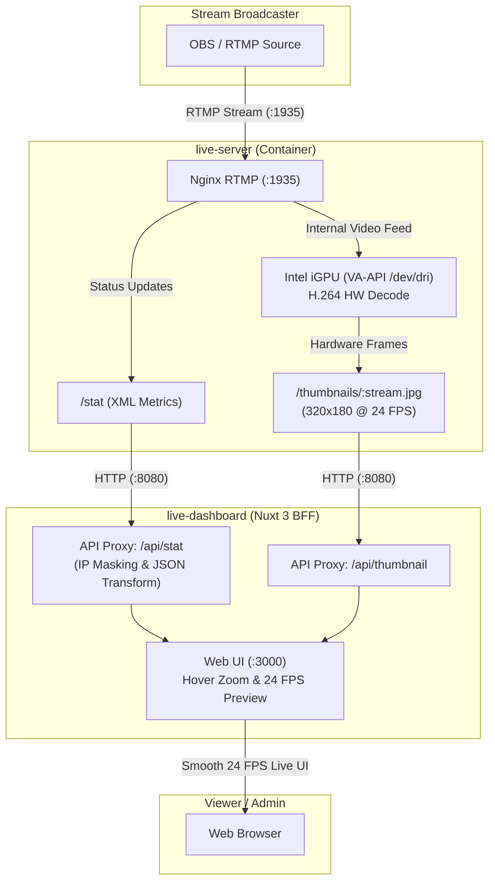
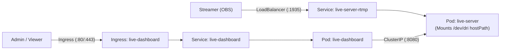

# rtmp-live-server

[](https://github.com/TechnoTUT/rtmp-live-server/actions/workflows/release-containerimage.yml)

A high-performance, ultra low-latency RTMP streaming server paired with a modern Nuxt 3 stream monitoring dashboard (BFF architecture).  
Utilizes **Intel iGPU (VA-API)** hardware acceleration to deliver smooth, low-overhead live video previews (24 FPS) without exhausting CPU resources.

Based on [alqutami/rtmp-hls](https://hub.docker.com/r/alqutami/rtmp-hls) and [簡単ストリーミング中継サーバの作り方](https://zenn.dev/dropcontrol/articles/821c2a0132afd6).

---

## Features

- **Ultra Low-Latency RTMP**: Sub-second live delivery tuned with low-buffer directives and single-worker consistency.
- **Hardware-Accelerated Live Preview**: 24 FPS video preview via Intel iGPU (VA-API `/dev/dri`) with near-zero CPU usage.
- **Zero-Overhead Client Playback**: Fluid preview via off-DOM image swaps—no heavy browser video decoders required.
- **Hover Zoom Preview**: Smooth `360x202` preview popover when hovering over any stream thumbnail.
- **Real-Time Stream Metrics**: Live tracking of bitrate (in/out), transferred data, active clients, and dropped frames.
- **Privacy First (BFF)**: Automatically masks publisher and subscriber IP addresses.
- **Multi-Arch & Kubernetes Ready**: Automated `linux/amd64` and `linux/arm64` CI/CD builds with production Kubernetes manifests.

---

## Architecture



---

## Quick Start (Podman Compose / Docker Compose)

### 1. Launch Services
```bash
git clone https://github.com/TechnoTUT/rtmp-live-server.git
cd rtmp-live-server
podman-compose up -d
# or: docker compose up -d
```

### 2. Start Broadcasting
Configure your streaming software (e.g., OBS):
- **Server**: `rtmp://<server-ip>:1935/live`
- **Stream Key**: `test` (or any custom key)

### 3. Open Dashboard
Open [http://localhost:3000](http://localhost:3000) in your web browser.  
Real-time metrics, connection tables, and the hover-zoomable 24 FPS live preview will appear automatically.

---

## Kubernetes Deployment

Production-grade Kubernetes manifests are located in [`k8s/deployment.yaml`](k8s/deployment.yaml).



### Deployment Instructions

1. **Configure Ingress Host**
   Update the host rule in [`k8s/deployment.yaml`](k8s/deployment.yaml) from `rtmp-dashboard.example.com` to your desired domain.

2. **Verify Node GIDs for `/dev/dri`**
   Ensure `supplementalGroups: [44, 105]` in the manifest matches your node's `video` and `render` group IDs:
   ```bash
   getent group video render
   ```

3. **Apply Manifest**
   ```bash
   kubectl apply -f k8s/deployment.yaml
   ```

4. **Verify Deployment**
   ```bash
   kubectl get pods,svc,ingress -n rtmp-live
   ```

---

## Configuration & Environment Variables

### Dashboard (`live-dashboard`)
| Variable | Default | Description |
| :--- | :--- | :--- |
| `RTMP_STAT_URL` | `http://live-server:8080/stat` | Upstream Nginx RTMP `/stat` XML endpoint |
| `RTMP_THUMBNAIL_BASE_URL` | `http://live-server:8080/thumbnails` | Upstream Nginx JPEG thumbnails base URL |
| `HOST` | `0.0.0.0` | Node.js / Nuxt server listen host |
| `PORT` | `3000` | Node.js / Nuxt server listen port |

---

## License & Acknowledgments
- **License**: MIT License
- **Special Thanks**: [alqutami/rtmp-hls](https://hub.docker.com/r/alqutami/rtmp-hls) and [簡単ストリーミング中継サーバの作り方](https://zenn.dev/dropcontrol/articles/821c2a0132afd6)